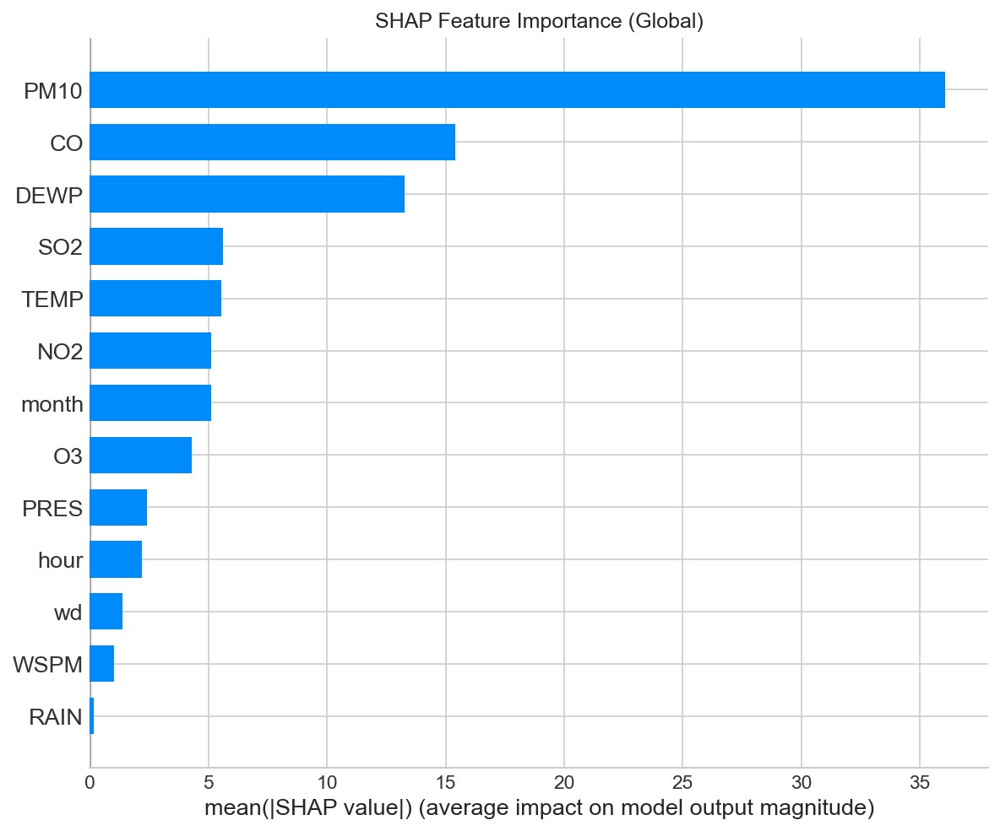
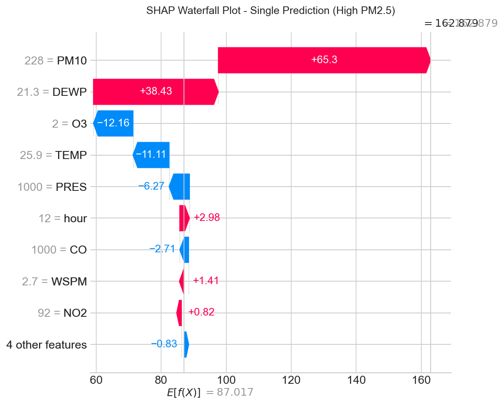
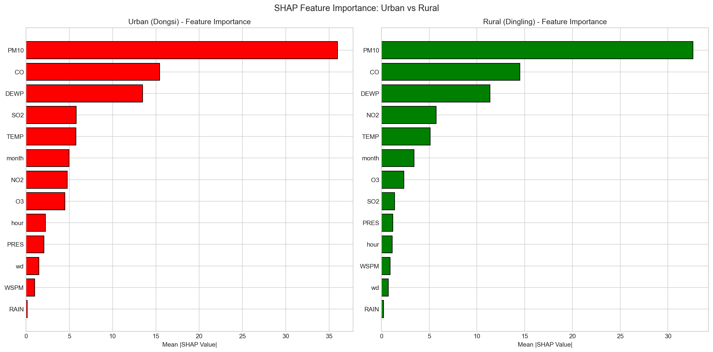

# Beijing Air Quality XAI Analysis

> Explainable AI (XAI) for PM2.5 Prediction using SHAP and DiCE

[](https://www.python.org/)
[](https://xgboost.readthedocs.io/)
[](https://shap.readthedocs.io/)
[](https://github.com/interpretml/DiCE)

## Overview

This project applies **Explainable AI (XAI)** techniques to understand and interpret air quality predictions in Beijing. Using machine learning to predict PM2.5 concentrations, we employ SHAP for feature importance analysis and DiCE for counterfactual explanations.

**Course**: WQF7009 Explainable Artificial Intelligence  
**University**: University of Malaya  
**Academic Session**: 2025/2026 Semester I

---

## Dataset

**Source**: [Beijing Multi-Site Air Quality Data](https://archive.ics.uci.edu/dataset/501/beijing+multi+site+air+quality+data) - UCI Machine Learning Repository

| Property | Value |
|----------|-------|
| Time Period | March 2013 - February 2017 |
| Frequency | Hourly observations |
| Primary Station | Dongsi (Urban Center) |
| Comparison Station | Dingling (Rural) |
| Total Observations | 35,064 per station |

### Features (13)

| Category | Features |
|----------|----------|
| **Pollutants** | PM10, SO2, NO2, CO, O3 |
| **Weather** | TEMP, PRES, DEWP, RAIN, WSPM |
| **Wind** | wd (16 directions) |
| **Temporal** | hour, month |

### Target Variable
- **PM2.5**: Fine particulate matter concentration (µg/m³)

---

## Project Structure

```
xai-air-quality/
├── README.md
├── requirements.txt
├── notebooks/
│   ├── 01_shap_dice_analysis.ipynb    # Main XAI analysis (Dongsi)
│   └── 02_shap_site_comparison.ipynb  # Urban vs Rural comparison
├── data/
│   ├── raw/                           # Original station data
│   │   ├── PRSA_Data_Dongsi_*.csv
│   │   └── PRSA_Data_Dingling_*.csv
│   └── processed/                     # Train/val/test splits
├── models/
│   └── xgboost_model.pkl              # Trained XGBoost model
├── outputs/
│   ├── figures/                       # All visualizations
│   └── tables/                        # Counterfactual results
└── beijing-multisite-uci/             # Full original dataset (12 stations)
```

---

## XAI Methods

### 1. SHAP (SHapley Additive exPlanations)

**Purpose**: Understand *why* the model makes specific predictions

| Type | Scope | Visualization |
|------|-------|---------------|
| Global | Overall feature importance | Summary bar plot, Beeswarm plot |
| Local | Individual prediction explanation | Waterfall plot |

**Categorization**:
- Local vs Global: **Both**
- Post-hoc vs Intrinsic: **Post-hoc**
- Model-specific vs Agnostic: **Model-agnostic**

### 2. DiCE (Diverse Counterfactual Explanations)

**Purpose**: Answer *"What changes would lead to a different outcome?"*

Example: "To reduce PM2.5 from 150 to 50 µg/m³, change wind direction from SE to NW and reduce CO from 1500 to 600."

**Categorization**:
- Local vs Global: **Local**
- Post-hoc vs Intrinsic: **Post-hoc**
- Model-specific vs Agnostic: **Model-agnostic**

---

## Key Analyses

### Notebook 1: Main XAI Analysis
- Exploratory Data Analysis (EDA)
- XGBoost model training and evaluation
- **SHAP Global**: Feature importance ranking
- **SHAP Local**: High pollution event explanation
- **SHAP Comparisons**:
  - Peak Hour (8 AM) vs Night Time (3 AM)
  - Winter (December) vs Summer (July)
  - High Pollution vs Low Pollution days
- **Wind Direction Analysis**: Which directions bring/clear pollution
- **DiCE Counterfactuals**: Actionable scenarios to reduce PM2.5

### Notebook 2: Site Comparison
- Urban (Dongsi) vs Rural (Dingling) comparison
- Side-by-side SHAP feature importance
- Key insight: Similar pollution drivers across sites, suggesting regional pollution transport

---

## Sample Outputs

### SHAP Feature Importance


### SHAP Waterfall (Local Explanation)


### Urban vs Rural Comparison


---

## Installation

```bash
# Clone the repository
git clone https://github.com/yourusername/xai-air-quality.git
cd xai-air-quality

# Create virtual environment (recommended)
python -m venv venv
source venv/bin/activate  # On Windows: venv\Scripts\activate

# Install dependencies
pip install -r requirements.txt
```

## Requirements

```
pandas>=1.5.0
numpy>=1.23.0
matplotlib>=3.6.0
seaborn>=0.12.0
scikit-learn>=1.1.0
xgboost>=1.7.0
shap>=0.41.0
dice-ml>=0.9
joblib>=1.2.0
```

---

## Usage

### Run Jupyter Notebooks

```bash
# Start Jupyter
jupyter notebook

# Open notebooks/01_shap_dice_analysis.ipynb
```

### Quick Start (Python)

```python
import joblib
import pandas as pd

# Load trained model
model = joblib.load('models/xgboost_model.pkl')

# Load sample data
df = pd.read_csv('data/processed/test.csv')

# Make prediction
X = df.drop('PM2.5', axis=1)
predictions = model.predict(X)
```

---

## Model Performance

| Metric | Value |
|--------|-------|
| RMSE | ~25-30 µg/m³ |
| MAE | ~15-20 µg/m³ |
| R² | ~0.85-0.90 |

*Exact values depend on train/test split*

---

## Key Findings

1. **Top Pollution Drivers**: CO, PM10, and DEWP (dew point) are the strongest predictors of PM2.5
2. **Temporal Patterns**: Rush hours (8 AM, 6 PM) show higher pollution; winter worse than summer
3. **Wind Effect**: Northwest winds clear pollution; Southeast winds bring pollution
4. **Urban vs Rural**: Similar feature importance patterns suggest regional pollution transport rather than purely local sources

---

## Future Work

- [ ] Streamlit dashboard for interactive XAI exploration
- [ ] Multi-site comparison with industrial areas
- [ ] Time-series forecasting with LSTM + XAI
- [ ] Real-time prediction API

---

## References

- **Dataset**: Zhang, S., et al. (2017). Beijing Multi-Site Air Quality Data. UCI Machine Learning Repository.
- **SHAP**: Lundberg, S. M., & Lee, S. I. (2017). A Unified Approach to Interpreting Model Predictions. NeurIPS.
- **DiCE**: Mothilal, R. K., et al. (2020). Explaining Machine Learning Classifiers through Diverse Counterfactual Explanations. FAT*.

---

## License

This project is for academic purposes as part of the WQF7009 Explainable AI course at University of Malaya.

---

## Author

**Course**: WQF7009 Explainable Artificial Intelligence  
**Program**: Master of Artificial Intelligence  
**University**: University of Malaya  
**Session**: 2025/2026 Semester I
